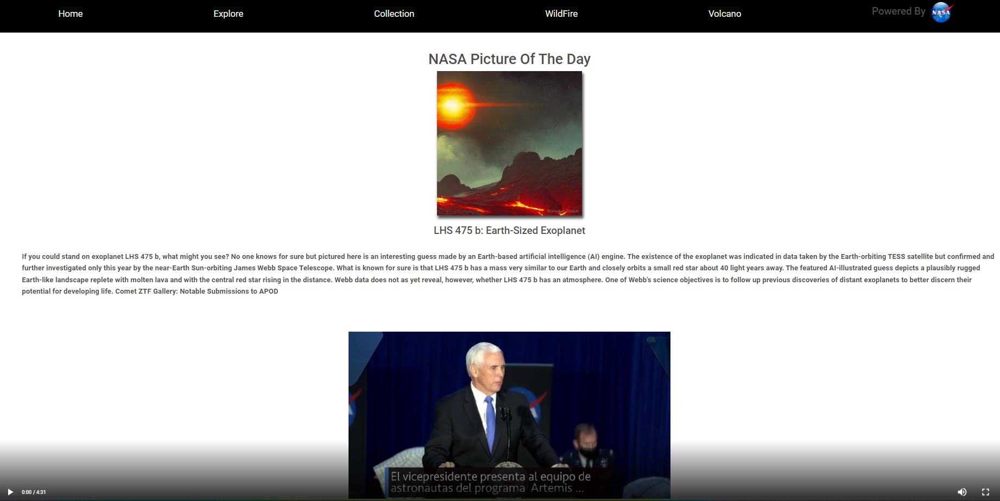
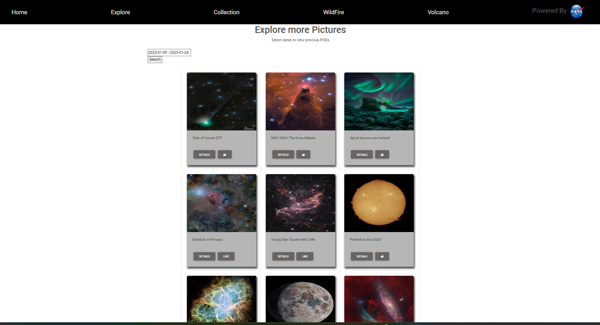
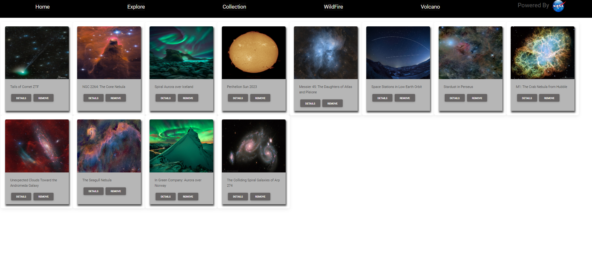
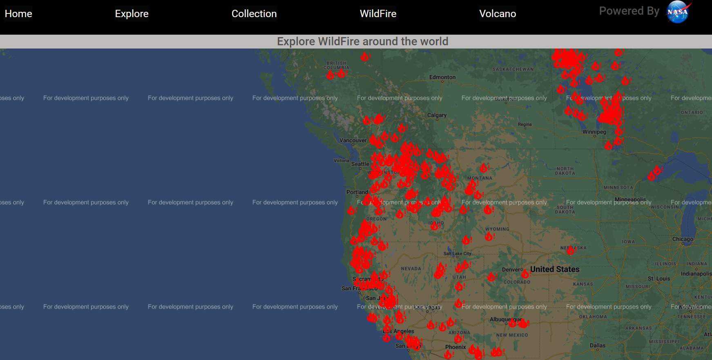
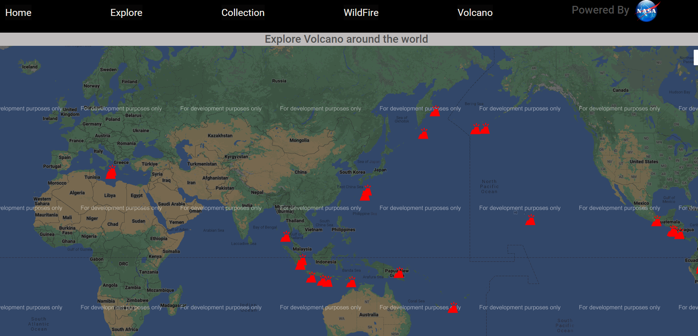

# The Space Explorer-Powered by NASA

>The Project Description

 This project mainly focus on developing a Front-end React website by manipulating open source NASA-Api

>API used:

- NASA API: https://api.nasa.gov/ 

- Google Maps JavScript API: https://console.cloud.google.com/

>Technology Implemented

The website is developed with 
- ReactJS
- Redux
- BootStrap
- CSS
- Used Browser Local Storage

>Routes

 - **'/'**- Home page
- **'/gallery'**- list all the pods within selected date

- **'/gallery/:id**- show details of a particular pod 
- **'/collection'**- shows the liked pods
- **'/wildfire'** - shows wildfire location around the world in google maps
- **'/volcano'** - show active volcano locations around the world
>PAGES

>HomePage:
Home Page of the Application make API call to NASA OpenAPI and fetch Picture of the day and displays it, also fecth a vedio from NASA API

>Gallery Page:
Shows the POD images between selected dates

>CollectionPage:
Collection Page List the list of liked pictures from the gallery.

>Challenges 

>WildfirePage:

This page displays Natural Wildfire Events occured around the world plotted on Google Maps.

>Volcano Page:
 This page displays Natural volcano events occured around the world by fetching Geo coordinates feom NASA API and plotting on Google map API.
 

 >Future Implementation

 - working more on Google Map and understanding its various applications
 - work more on designing UI 
 - Implement Axios

>Installation

clone the repository and npm install to install the dependencies

>Project Live:
https://react-nasa-api-project.onrender.com